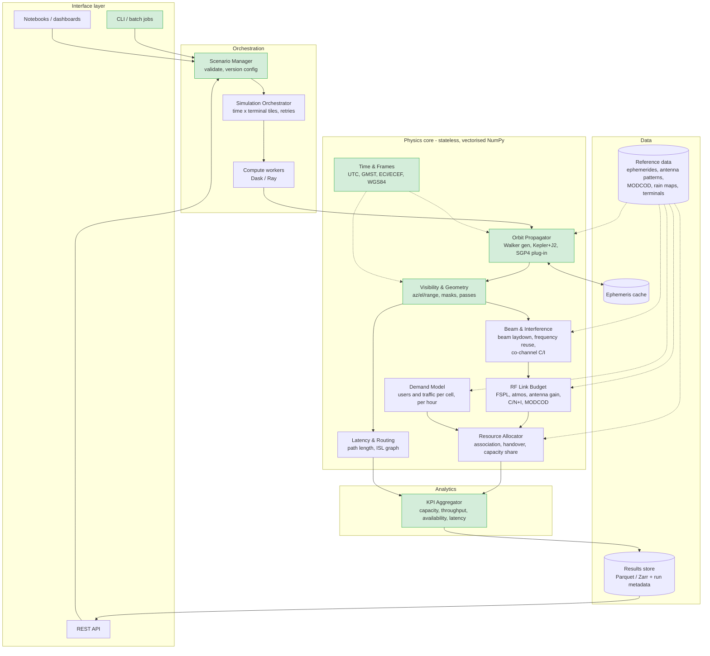
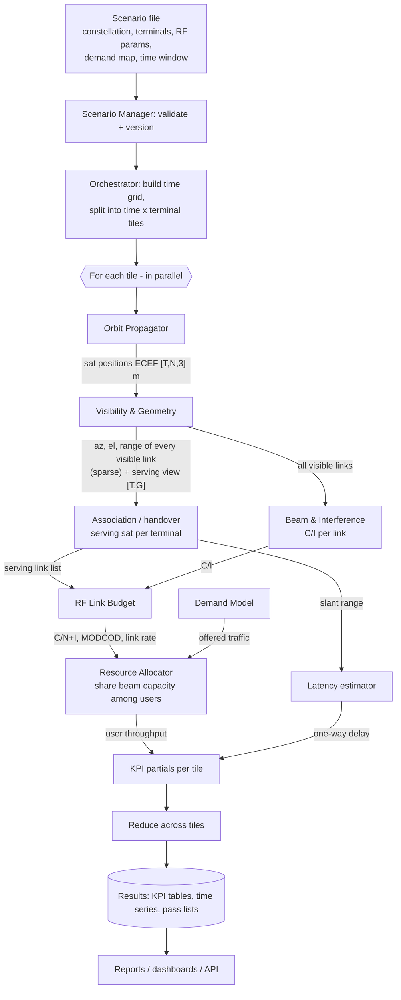
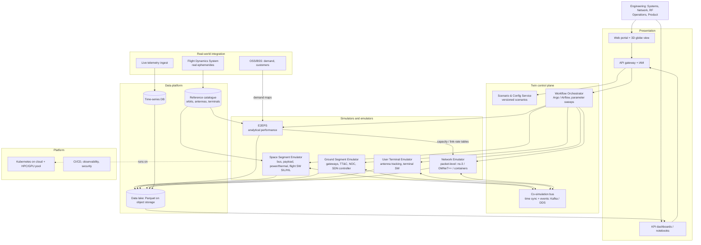

# E2EPS — Architecture, Workflow & Digital Twin

## 1. E2EPS software architecture

Stateless, vectorised physics core; orchestration splits the problem into
independent tiles (time × terminals) and runs them in parallel; the data layer
owns persistence. Green modules are implemented in this repo (`src/e2eps/`).

Notes on the modules added since the first draft:
- **Demand Model.** Capacity only means something against demand. Without it,
  E2EPS can report link rates but not user throughput or congestion.
- **Beam & Interference.** With frequency reuse across beams and satellites,
  capacity is limited by C/(N+I), not C/N. It needs **every** visible link,
  which is why Visibility keeps a sparse list of all links, not just the
  serving one.

### 1.1 Interface contracts

Rules for every interface: SI units with the unit in the field name (`_m`,
`_deg`, `_s`); time as seconds from the scenario epoch, which must include a
timezone (UTC recommended); satellites and terminals referred to by stable string
IDs; and a schema version in the run metadata.

| # | Producer → consumer | Contract | Format | Status |
|---|---|---|---|---|
| 1 | User → Scenario Manager | Shells, terminals, time window, epoch. The SHA-256 of the file is the scenario version. | JSON (JSON Schema next) | ✅ `scenario.py` |
| 2 | Orbit Propagator → Visibility | `positions_ecef(t_s)` → float64 `[T, N, 3]` m, Earth-fixed | In-process `Propagator` protocol | ✅ `orbit.py` |
| 3 | Visibility → KPI, RF | Per (t, terminal), `[T, G]`: `n_visible`, `best_sat` (−1 = outage), `best_el_deg`, `best_range_m` | In-process arrays | ✅ `visibility.py` |
| 4 | Visibility → Beam & Interference, Resource Allocator | Every visible link: `t, g, n, az_deg, el_deg, range_m` | In memory today; Parquet per tile next | ✅ in memory |
| 5 | Demand Model → Resource Allocator | Offered traffic per cell or terminal per hour, Mbps | Parquet | Planned |
| 6 | RF → Resource Allocator | Per link: C/(N+I) dB, MODCOD id, spectral efficiency bit/s/Hz, link rate Mbps | Parquet | Planned |
| 7 | Resource Allocator → KPI | Per (t, terminal): serving sat and beam, allocated throughput Mbps | Parquet | Planned |
| 8 | Latency & Routing → KPI | Per (t, terminal): one-way delay ms, split into access + ISL + feeder | Parquet | Planned |
| 9 | KPI → Results store / API | Per-terminal KPI table + `run_meta.json` (scenario hash, code version, runtime) | CSV/JSON today; Parquet + metadata next | ✅ `kpi.py`, `cli.py` |
| 10 | E2EPS → Digital Twin Network Emulator | Time-indexed capacity and delay per (terminal, sat) link | Parquet / co-simulation bus | Planned (§3) |

## 2. Workflow and data exchanged

## 3. Digital Twin solutions architecture

## 4. Scaling strategy (the computing limitations)

The approach is: **measure first, then vectorise, compile, distribute, and only
then rewrite hot spots in another language.** Each step is taken only when a
measurement says the previous one is not enough.

### 4.1 Where we are (measured, `benchmarks/bench_visibility.py`)

Single process, Apple M5 laptop: **~40 M geometry evaluations/s**. A run of
576 sats × 500 terminals × 6 h at 30 s steps (207 M evaluations) takes ~5 s.
The vectorised kernel is ~30–70× faster than the loop version.

### 4.2 What full scale looks like (estimate from the measured rate)

| Case | Size | Single process | Implication |
|---|---|---|---|
| Global grid, 24 h at 10 s | 41,162 cells (H3 res 3) × 576 sats × 8,640 steps = **2.0 × 10¹¹** evaluations | ~85 min | OK for one run, too slow to iterate on |
| Parameter sweep | 50 scenarios of the above | **~71 h** | Needs parallel workers: ~1.1 h on 64 cores if scaling were perfect |
| Memory, today's time-only chunks | 60 steps × 41,162 × 576 float64 | **11.4 GB per array**, and the kernel holds several | Must also tile over terminals: 60 × 1,000 → 276 MB per array |
| Sparse visible links | 1.5–2.7% of 2.0 × 10¹¹ | **3–5.5 × 10⁹ links ≈ 120–220 GB** | Cannot stay in memory: stream to Parquet per tile, or reduce in the tile |

### 4.3 Steps

| Step | What | Status | Expected gain / trigger |
|---|---|---|---|
| 1. Vectorise | Matrix-multiply kernel, no `[T,G,N,3]` array, azimuth only for visible links | ✅ Done | ~30–70× vs loops (measured) |
| 2. Bound memory | Chunk the time axis | ✅ Done | Memory set by `chunk_steps` |
| 3. 2-D tiles | Tile **time × terminals**; write sparse links per tile to Parquet; reduce KPIs inside the tile (map-reduce); keep only the top-K candidate sats per terminal for the allocator | Next | Needed for global grids (§4.2). No change to the physics code. |
| 4. Smaller types | Store outputs as float32 (range resolution < 1 m at LEO distances); keep the kernel in float64 | Next | Halves output size and I/O |
| 5. Compile | Numba (fuse operations, no temporaries) or JAX (same NumPy API, runs on GPU) for `look_angles` | When profiling shows the kernel dominates | To be benchmarked; the kernel is matrix maths, which GPUs handle well |
| 6. Distribute | Dask / Ray workers over tiles. Tiles are independent because orbits are closed-form, so there is no shared state | When one run or sweep is too slow (§4.2) | Close to linear in cores; only the reduce step is shared |
| 7. Rewrite hot spot | Go / Rust / C++ for a proven bottleneck only | Only if steps 1–6 are not enough | Keeps Python as the integration layer |

**Why not rewrite in Go or Java now?** The hot loop is already running in
compiled BLAS code via NumPy. A rewrite would give up the NumPy / JAX / GPU
ecosystem and the scientific libraries the Engineering teams use, for a gain
not yet shown by any measurement. Go is a good fit for the **service** layer
instead (API gateway, Scenario & Config Service, orchestrator workers), where
concurrency and deployment matter more than numerical maths.

## 5. From prototype to production

| Concern | Today | Next |
|---|---|---|
| Reproducibility | Scenario SHA-256 + code version + runtime in `run_meta.json`; epochs must include a timezone | Pinned environment (lock file, container image digest) in the metadata |
| Correctness | 56 unit tests; vectorised kernel = loop reference; geometry and GMST cross-checked against `pymap3d` and ERFA during development | Turn the cross-checks into tests; compare against Flight Dynamics ephemerides and an existing tool (STK or in-house) |
| Data contracts | Field names with units, documented in §1.1 | JSON Schema for scenarios; versioned Parquet schemas between modules |
| Automation | CLI, `pip install`, single-file binary (PyInstaller) | CI on every push; container image; orchestrated runs (§3) |
| Observability | Total runtime per run | Per-tile timing and memory, structured logs, metrics to the Digital Twin platform |
| Access | Local | API gateway + IAM (§3); data-classification rules from Engineering (question 21) |
