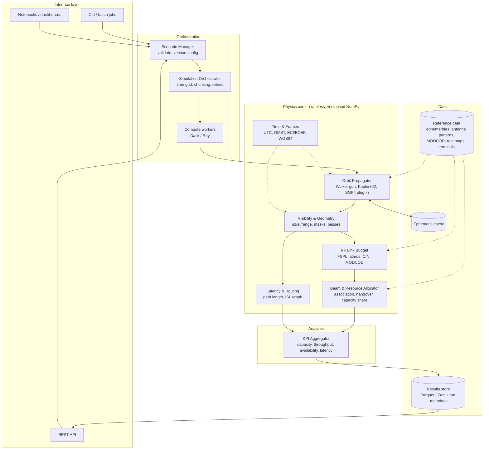
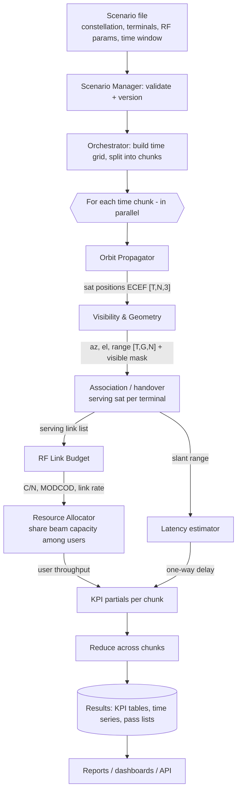

# E2EPS — Architecture and Workflow

## 1. E2EPS software architecture

Stateless, vectorised physics core; orchestration splits the time axis into
chunks and runs them in parallel; data layer owns persistence.

## 2. Workflow and data exchanged

