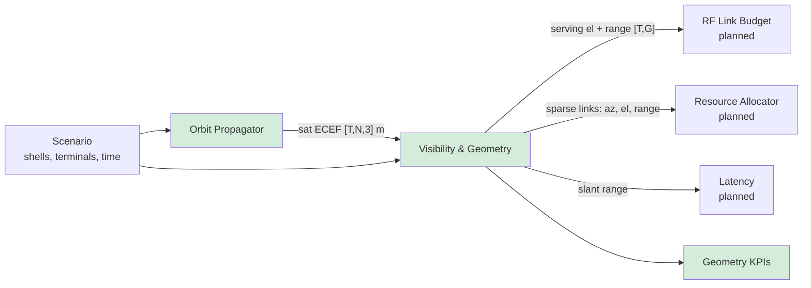

# E2EPS — Module Inputs & Outputs, and Why They Matter

This document defends the two modules implemented, **Orbit Propagator** and
**Visibility & Geometry**, plus the geometry KPIs built on top of them. For each
input and output it gives units, shape, consumer, and what goes wrong
downstream if the value is wrong. Assumption IDs (`A#`) refer to
[`QUESTIONS_AND_ASSUMPTIONS.md`](QUESTIONS_AND_ASSUMPTIONS.md).

## 1. Why these two modules first

1. **They are on the critical path of every KPI.** Capacity, throughput,
   availability and latency all start from "which satellite can this terminal
   see, at what elevation and range?". No other module can run without them.
2. **They are the computing hot spot.** Geometry scales with
   time steps × terminals × satellites. That is where the brief's "computing
   limitations" come from, so it is where architecture decisions pay off first.
3. **They depend only on parameters we can reason about today.** Orbits and
   ground locations are public-domain physics. The RF module needs antenna
   patterns, MODCOD tables and EIRP that only RF Engineering can supply
   (questions 5–10).
4. **Their outputs are useful to Engineering on their own.** Coverage,
   availability bounds, pass plans and handover rates answer real Systems
   questions before any RF data exists (see `scenarios/what_if_polar_only.json`).

## 2. Orbit Propagator — `orbit.py`

### Inputs

| Input | Type / unit | Why it is critical |
|---|---|---|
| Shell: `altitude_km` | km, 200–2000 | Sets slant range (path loss, delay), footprint size, and orbital period. +100 km at 1050 km adds ~0.8 dB of FSPL overhead. |
| Shell: `inclination_deg` | deg, 0–180 | Sets the highest latitude served. The polar vs inclined mix decides where capacity goes (high-latitude vs populated mid-latitudes). |
| Shell: `planes`, `sats_per_plane` | int ≥ 1 | Constellation size, hence the number of visible satellites, hence capacity and redundancy. |
| Shell: `phasing` (Walker F), `pattern` (delta / star) | int 0..P−1; enum | Same satellite count, different gaps in coverage. A wrong pattern makes a valid design look broken (or the opposite). |
| `epoch` | UTC datetime | Ties the model to Earth rotation (GMST). Required to compare with real ephemerides later (A3, A9). |
| Time grid `t_s` | s, 1-D | Resolution vs cost trade-off. Too coarse misses short outages (A7). |

### Outputs

| Output | Shape / unit | Consumer | Why it is critical |
|---|---|---|---|
| `positions_ecef(t)` | `[T, N, 3]` m, Earth-fixed | Visibility; 3D view in the Digital Twin | Ground terminals are fixed in ECEF, so this is the frame in which line-of-sight is cheap to compute. |
| `positions_eci(t)` | `[T, N, 3]` m, inertial | ISL geometry, Latency & Routing (planned) | ISL distances and Sun/eclipse geometry are naturally inertial. |
| `Constellation.ids` | `N` strings, e.g. `POLAR-P03S17` | Every table that names a satellite | Plane and slot can be read from the name, which keeps reports usable for Ops. |

### Design decisions to defend
- **`Propagator` protocol.** Downstream code only calls `positions_ecef(t)`.
  Swapping the J2 model for SGP4 (real TLEs) or Flight Dynamics ephemerides
  changes one class, not the pipeline. This is the hook the Digital Twin's live
  mode needs.
- **Circular orbits + J2 secular drift (A2).** This is the standard
  design-phase model: closed form, so any time can be evaluated directly with
  no step-by-step integration. That makes chunks independent, which allows
  parallel runs. It is checked against a hand calculation (RAAN drift
  −4.49°/day at 550 km, 53°) and against orbit closure after one period with
  J2 off.

## 3. Visibility & Geometry — `visibility.py`

### Inputs

| Input | Type / unit | Why it is critical |
|---|---|---|
| Satellite ECEF | `[T, N, 3]` m | From any `Propagator`. |
| Terminal `lat_deg`, `lon_deg`, `alt_m` | WGS84 deg, deg, m | Converted to ECEF on the real ellipsoid, not a sphere. Assuming a sphere would shift high-latitude terminals by up to ~21 km. |
| Terminal `min_el_deg` | deg, **per terminal** | The single most influential parameter on availability (A5). It is per terminal because user terminals (25°) and gateways (10°) differ, and so will maritime/aero terminals. |
| Terminal `kind` | `user` / `gateway` | Keeps the same geometry code for both while letting later modules treat feeder links differently (S3). |
| `chunk_steps` | int | Caps peak memory. Results do not depend on it (tested with 1, 7 and 1000). |

### Outputs

**Dense per (time, terminal), `[T, G]`, the serving view:**

| Output | Unit | Consumer | Why it is critical |
|---|---|---|---|
| `n_visible` | count | KPIs; Resource Allocator | 0 = outage. More than 1 means the system has a choice: diversity, load balancing, make-before-break handover. |
| `best_sat` | sat index, −1 = none | Handover analysis; RF | Which satellite serves the terminal (highest elevation for now, A6). Each change in it is a handover. |
| `best_el_deg` | deg | **RF Link Budget** | Elevation drives three link-budget terms: atmospheric path length (∝ 1/sin el: **2.37×** zenith at 25°, **5.76×** at 10°), antenna scan loss on flat phased arrays (scan = 90° − el), and slant range. |
| `best_range_m` | m | **RF Link Budget, Latency** | FSPL = 20·log10(4πd/λ): 178.9 dB overhead vs 184.4 dB at 25° (20 GHz). One-way delay = d/c: 3.5–6.6 ms with a 25° mask (up to 9.5 ms for 10° gateways). |

**Sparse, every visible link (t, terminal, sat, az, el, range):**

| Output | Consumer | Why it is critical |
|---|---|---|
| `links` | Resource Allocator, interference (C/(N+I)), beam planning | Capacity sharing and interference need **all** satellites in view, not just the serving one. Azimuth is added here because beam and antenna pointing needs a direction, not just an angle above the horizon. |
| `passes()`: start, end, max elevation per (terminal, sat) | Ops (gateway contact plans), Network (handover planning) | Pass duration (median 7 min, max 8.5 min at London in the sample run) limits how long a session lasts on one satellite. Gateway contact windows bound feeder-link capacity. |

### Design decisions to defend
- **Sparse output.** In the sample run only **2.7%** of the
  time × terminal × satellite cube is above the mask (1.5% in the benchmark).
  Keeping only visible links means memory grows with *visible* links, not
  T×G×N. This is the difference between "fits on a laptop" and "needs a cluster"
  for a global grid.
- **Chunking the time axis.** Each chunk is independent (closed-form orbits),
  so the same loop scales out across processes or machines (Dask/Ray) without
  changing the physics code. Peak memory is set by `chunk_steps`.
- **Dot-product kernel.** Elevation and range are written as two matrix
  multiplies rather than building a `[T, G, N, 3]` line-of-sight array. This is
  53× faster than the loop version, and the benchmark shows 207 M geometry
  evaluations in about 5 s on a laptop. The loop version is kept as
  `elevation_reference` and tested for equality.
- **Azimuth only on the sparse set.** It costs an `atan2` per link, so it is
  computed only for the 1.5–3% of links that are visible.

## 4. Geometry KPIs — `kpi.py`

Each KPI answers a concrete question for a named team. They are **best-case
limits** (S2): RF and capacity sharing can only make them worse.

| KPI | Question it answers | Team |
|---|---|---|
| `availability_pct` | What share of the time is at least one satellite above the mask? | Systems (SLA), Product |
| `mean_visible_sats`, `min_visible_sats` | How much redundancy and choice is there for load balancing, and what is the worst case? | Systems, Network |
| `longest_outage_s` | What is the worst continuous gap? It matters more to users than the average. | Systems, Product |
| `mean_serving_el_deg` | What is the typical link geometry, before running a full RF study? | RF |
| `access_delay_ms_mean`, `_p95` | What is the user↔satellite part of latency (A8)? The p95 matters because SLAs are written on percentiles. | Network, Product |
| `handovers` | How often does the serving satellite change? This is an upper bound, because there is no hysteresis (A6). | Network |

Every run also writes `run_meta.json` with the scenario hash, code version and
runtime, so any KPI table can be traced back to the exact inputs.

## 5. How the outputs are verified

| Property | Test |
|---|---|
| Orbit radius stays constant; orbit closes after one period without J2; J2 RAAN drift matches the hand calculation | `test_core.py` |
| Satellite straight overhead → 90° elevation, range = altitude; azimuth of points due north / due east = 0° / 90° | `test_core.py` |
| Vectorised kernel = loop reference | `test_core.py` |
| Chunk size does not change results | `test_core.py` |
| Pass windows are consistent with the links | `test_core.py` |
| KPI arithmetic on a hand-built case (outage, handovers, never-served terminal) | `test_kpi.py` |
| Bad scenarios are rejected; good edge cases are accepted | `test_scenario.py` |
| End-to-end CLI writes every output, and the metadata matches the inputs | `test_cli.py` |
